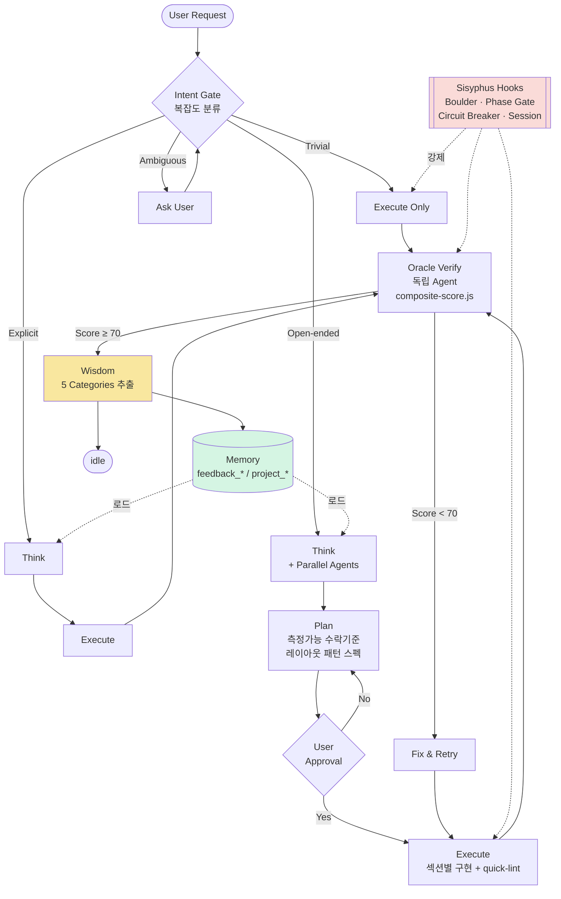
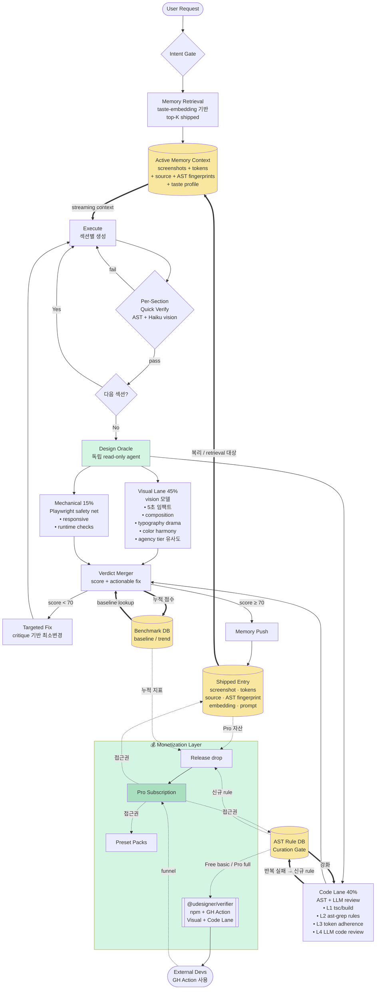

# UDesigner 실질적 가치증분 플랜

**목적**: Open Core + Newsletter 머니타이즈 모델을 지탱할 실제 자산과 복리 구조를 현재 레포 위에 구축한다.

**핵심 통찰**: 머니타이즈는 "축적된 지식 + 측정 가능한 결과" 두 축이 있어야 작동한다. 지금 레포에는 두 축 모두 시작점은 있지만 **자동 복리 구조가 없다**. 그걸 만드는 게 이 문서의 전부다.

---

## 🔥 P0 — 이것 없으면 팔 수 없음

### 1. Benchmark Suite (`benchmarks/`)

**문제**: "UDesigner가 더 잘 만든다"는 주장에 **숫자가 없다**. 구매자는 증거를 원한다.

**만들 것**:
```
benchmarks/
├── prompts.json              # 20-30개 표준 프롬프트
│                             # (SaaS landing, portfolio, pricing page, ...)
├── runs/
│   ├── vanilla-claude/       # 하네스 없이 돌린 결과
│   └── udesigner/            # 하네스로 돌린 결과
├── scores.json               # 각 run의 composite-score
└── report.md                 # 자동 생성 비교 리포트
```

**핵심 메트릭**:
- 평균 composite score (vanilla vs UDesigner)
- Anti-slop violation rate
- Layout diversity score
- Human intervention count (얼마나 "이상해, 다시" 했는지)

**값어치**: "UDesigner = 평균 87점, Vanilla Claude = 52점" 한 문장이 랜딩페이지 전부를 정당화한다. **Release 콘텐츠**도 여기서 나온다 ("이번 릴리스 기준 benchmark 평균 +3점, 이유는...").

**실행**: `node benchmarks/run.js --harness=udesigner|vanilla` CLI 추가. Playwright는 이미 있음.

---

### 2. Reference Corpus (`skills/reference-corpus/`)

**문제**: 지금 `/copy` 할 때마다 DOM 분석하고 **결과를 버린다**. 이게 가장 아까운 자산 유실이다.

**만들 것**: 분석한 에이전시/테크 사이트를 구조화해서 영구 보관.
```
skills/reference-corpus/
├── journey-digital/
│   ├── analysis.json         # DOM 구조, computed tokens
│   ├── screenshot-desktop.png
│   ├── screenshot-mobile.png
│   ├── extracted-tokens.css  # spacing, color, type
│   ├── layout-patterns.md    # 어떤 패턴을 썼는지
│   └── lessons.md            # 학습한 것
├── pagebreak-nyc/
├── vercel/
└── index.json                # 검색용
```

**운영**: 매 `/copy` 완료 시 자동으로 corpus에 저장 (wisdom 단계에서). 세션마다 자연 누적 — 주기 강제 없음.

**값어치**:
- **50개 쌓이면 이 자체가 unique IP**. 누구도 빠르게 복제 못 한다.
- Pro 구독자만 접근 → recurring 정당화.
- 뉴스레터: "This week we analyzed 3 new sites, here's what we found."
- `/design` 단계에서도 유사한 intent에 corpus 참조 → 생성 품질 상승 (self-reinforcing).

---

### 3. Failure Harvesting Pipeline (`verifier/harvest.js`)

**문제**: anti-slop 규칙은 지금 **수동으로** 추가된다. 이걸 자동화하면 **복리 구조**가 생긴다.

**만들 것**:
```js
// verifier/harvest.js
// 1. test-results/ 스캔 — 최근 실패 사례 수집
// 2. Oracle reject 이유 분류 — 반복되는 패턴 찾기
// 3. 3회 이상 반복된 실패 → candidate rule 생성
// 4. .udesigner/harvest-queue.md에 draft 저장
// 5. Curation Gate 통과 후 skills/anti-slop.md에 PR
```

**트리거**: `PostToolUse` hook이 Oracle reject 시 failure 카운트 올림. **임계치 도달 시 자동 발동** 또는 수동 `npm run harvest` — 캘린더 강제 없음.

**값어치**: 릴리스마다 "신규 anti-slop 규칙 N개" 콘텐츠 자동 확보. 시간이 흐를수록 **혼자 복제 불가능한 규칙 DB**로 성장.

---

## ⚡ P1 — Pro 구독 정당화

### 4. Preset Depth 확장

**문제**: 현재 `style-presets/*`는 토큰 나열 수준으로 얕다. $49-79 받기엔 부족하다.

**각 preset을 mini design system으로 확장**:
```
style-presets/obsidian/
├── tokens.md               # spacing, color, type (현재 내용)
├── patterns/
│   ├── hero-variants.md    # 이 스타일의 hero 3-5종
│   ├── cta-variants.md
│   ├── section-transitions.md
│   ├── signature-motion.md # 이 preset의 motion curve
│   └── typography-scale.md # 다양한 크기 조합
├── components/             # 즉시 복사 가능한 .tsx
│   ├── HeroMinimal.tsx
│   ├── FeatureSplit.tsx
│   └── ...
├── example-page.tsx        # 전체 페이지 레퍼런스
└── README.md               # 이 preset이 잘 맞는 use case
```

**값어치**: 각 preset이 **단독으로 "디자인 시스템 제품"**으로 팔릴 수 있다. 번들 $149, 개별 $49. 매달 새 preset 하나 추가하면 subscription churn 낮춘다.

---

### 5. Verifier as Standalone Product

**문제**: `verifier/composite-score.js`가 UDesigner 밖에서도 **독립 가치가 있다**. 지금은 이 레포 안에만 갇혀 있다.

**만들 것**:
```
verifier/
├── composite-score.js      # (현재)
├── package.json            # @udesigner/verifier로 npm 퍼블리시
├── cli.js                  # npx @udesigner/verifier <url>
└── github-action/
    └── action.yml          # PR에 점수 자동 코멘트
```

**전략**:
- **무료 티어**: 기본 mechanical checks + anti-slop 기본 20개 규칙
- **Pro 티어**: 전체 anti-slop DB (지속 업데이트) + reference corpus 비교
- GitHub Action 배포 → **UDesigner 모르는 사람도 사용** → 유입 채널

**값어치**: "Design quality CI"라는 완전 새 카테고리. Pro 구독의 **두 번째 훅**. 레포 star도 폭증할 가능성 높다.

---

## 📈 P2 — 신뢰 및 전환

### 6. Before/After Case Studies (`examples/case-studies/`)

**문제**: `examples/`가 "최종 결과물"만 있고 **과정**이 안 보인다. 랜딩 페이지에 쓸 증빙 부족.

**만들 것**:
```
examples/case-studies/
├── 01-saas-landing/
│   ├── prompt.md           # 정확히 사용한 프롬프트
│   ├── vanilla/            # 하네스 없이 생성 (스크린샷 + 점수)
│   ├── udesigner/          # 하네스로 생성 (스크린샷 + 점수)
│   ├── tpe-trace.md        # Think/Plan/Execute 로그
│   └── delta.md            # 무엇이 달라졌는가 해설
├── 02-portfolio/
└── 03-pricing-page/
```

**5-10개 케이스 + 각각 짧은 영상**: 랜딩페이지 전환율의 핵심. "이 프롬프트를 주면 vanilla는 이거 나오고, UDesigner는 이거 나옵니다."

---

### 7. Install CLI (`bin/udesigner`)

**문제**: 지금 세팅 절차가 "CLAUDE.md 읽고, hooks 복사하고, Playwright 설치하고..." → **첫 세션까지 30분**. 이탈률 높다.

**만들 것**:
```bash
npx udesigner init       # hooks 설치, phase.json/tasks.json 생성, 검증
npx udesigner doctor     # 설치 상태 진단 (Claude Code 버전, hooks, verifier)
npx udesigner bench      # 자기 설치로 benchmark 돌려서 "87점 나옴" 확인
npx udesigner update     # Pro skills/presets 최신화 (구독자만)
```

**값어치**:
- **첫 세션 시간 30분 → 2분**
- `doctor`는 "동작 안 해요" 지원 티켓 80% 제거
- `update`는 Pro 구독의 **기술적 게이트** — 자연스럽게 유료화 경계선 생김

---

## 우선순위 요약

| 순서 | 항목 | 이유 | 투입 |
|---|---|---|---|
| **1** | Benchmark Suite | 숫자 없으면 판매 불가 | ⭐⭐ |
| **2** | Reference Corpus (자동저장) | 진짜 moat, 복리자산 | ⭐⭐ |
| **3** | Failure Harvesting | 뉴스레터 연료 자동화 | ⭐ |
| **4** | Install CLI | 첫 경험이 brand를 만듦 | ⭐⭐ |
| **5** | Preset Depth | Pro 가격 정당화 | ⭐⭐⭐ |
| **6** | Verifier npm/GH Action | 유입 채널 확대 | ⭐⭐ |
| **7** | Case Studies | 전환율 | ⭐⭐ |

---

## 가장 중요한 한 가지

이 중에 **하나만 고르라면 #2 Reference Corpus + Wisdom 자동축적**이다. 이유:

- 나머지 6개는 전부 **한 번 만들면 끝**인 static asset이다.
- #2는 **세션이 늘어날수록 자산이 복리로 쌓인다**. 1년 후 분석한 사이트 200개가 있는 corpus는 누구도 1주일에 복제 못 한다.
- 이게 있어야 **뉴스레터가 진짜 정보값**을 가진다 ("이번 주 corpus에 추가된 3개 사이트 분석").
- Pro 구독이 **"계속 결제할 이유"**를 가진다 — 세션마다 자산이 자라니까.

**구체 첫 스텝**:
1. `skills/reference-corpus/` 디렉토리 생성
2. Wisdom 단계 훅에 "corpus 자동저장" 단계 추가 (phase === 'wisdom' 전환 시)
3. `/copy` 완료 시 DOM 분석 결과를 ephemeral이 아니라 corpus에 persist
4. 이미 한 Catalis/Obsidian/Dimension을 첫 3개 entry로 backfill

---

## 워크플로우 비교

### A. 현재 워크플로우 (v3, as-is)

각 세션은 **내부적으로 완결**된다. Wisdom이 메모리에 저장되지만 그 외엔 세션 산출물이 자산으로 영속화되지 않는다. **자산이 복리로 쌓이지 않는 구조**.



**한계**:
- Reference 분석 결과가 wisdom 이후 **소멸** → 매번 다시 함
- 실패 사례가 **수동**으로만 anti-slop에 반영됨
- 성능 향상에 대한 **측정 기준 없음** (얼마나 개선됐는지 숫자로 없음)
- 외부 유입 채널 **전무** (Claude Code + 이 레포 밖에서는 존재감 0)

---

### B. Pillar-Based Workflow (simplified + monetization-ready)

**핵심 가설**: 현재 하네스의 복잡도 대부분은 **Memory와 Verify가 둘 다 약하기 때문에** 생긴 보강 장치다. 두 pillar를 두껍게 만들면 나머지 scaffolding은 대부분 소멸한다.

- **Pillar A — Design Memory**: anti-pattern log가 아니라 **visual + structural intent store**. 스크린샷·토큰·소스·AST fingerprint·taste embedding을 한 묶음으로 저장하고, Execute 단계에 **active context로 상주**시켜 one-shot 드리프트를 막는다.
- **Pillar B — Design Oracle**: rule linter가 아니라 **독립 read-only agent**. Visual Lane(vision 모델)과 Code Lane(AST + LLM review)이 **병렬**로 판정하고, 기존 Mechanical(Playwright)은 safety net으로 격하된다.



**핵심 차이점**:

| 측면 | 현재 (v3) | Pillar-based |
|---|---|---|
| **Memory 저장 형태** | 텍스트 lesson only | 스크린샷 + 토큰 + 소스 + AST fingerprint + embedding |
| **Memory 활성 구간** | Think phase에서만 로드 | Execute 내내 streaming context 상주 |
| **Verify 판정 주체** | Playwright mechanical rules | Vision 모델 + AST + LLM review (read-only agent) |
| **Visual 판단** | pixel diff (reference 있을 때만) | semantic vision 점수 (5초 임팩트 등) |
| **Code 판단** | regex anti-slop scan | AST structural rules + LLM code review |
| **가중치** | mechanical 75% / reference 25% | visual 45% / code 40% / mechanical 15% |
| **Verify 타이밍** | Execute 끝에 1번 | per-section quick + 최종 Oracle 병렬 |
| **실패 대응** | Circuit Breaker + 재작성 | actionable critique 기반 targeted fix |
| **자산 성장** | 선형 (파일 편집) | 복리 (shipped entry마다 5개 차원 누적) |
| **유통 채널** | 이 레포뿐 | npm + GH Action (Visual+Code) + Release + CLI |
| **수익 모델** | 없음 | Pro 구독이 Shipped · AST Rule · Preset의 단일 관문 |

**구조적 변화 한 줄**: 7개 복리 자산을 흩뿌리는 대신 **Pillar A(Memory)와 Pillar B(Oracle) 두 축에 수렴**시킨다. Benchmark DB · AST Rule DB는 독립 자산이 아니라 두 Pillar의 **부산물**이다.

### 설계 메모 1: Benchmark은 왜 Think가 아니라 Oracle에 있는가

Benchmark Baseline을 Execute 전 조사 대상으로 두지 **않는다**:

1. **Benchmark은 스칼라 숫자, 생성 입력이 아니다**. Memory retrieval(스크린샷·토큰·소스)은 디자인 결정에 **직접 쓰인다**. "이 prompt는 평균 85점"은 어떤 hero를 쓸지에 대해 아무것도 말해주지 않는다.
2. **Anchor bias**. 생성 단계에서 목표 점수를 알면 에이전트가 **그 선만 맞추고 멈춘다**. Baseline은 사후 판정선이어야 한다.
3. **입력 팽창은 독**. Execute 진입 전 조사가 많아질수록 context가 흐려진다. Memory Retrieval 한 경로로 충분하다.
4. **책임 분리**. Memory → Execute = **생성**. Oracle = **판정**. Benchmark은 판정 쪽 자산.

Benchmark DB는 **Oracle이 읽고, Memory Push가 간접적으로 쓴다** (Oracle merger가 점수를 BDB에 +1). 세션이 쌓일수록 baseline이 정교해지고, 정교한 baseline이 다음 Oracle 판정을 엄격하게 만든다.

### 설계 메모 2: Visual Lane만으로 왜 부족한가 — Code Lane이 필요한 이유

정적 스크린샷은 **렌더된 한 순간**의 증거일 뿐이라 다음을 **구조적으로 못 잡는다**:

- `useInView` on hero (Playwright가 스크롤하면 결국 보임)
- `transform/opacity` 외 애니메이션 (최종 렌더 동일, perf 재앙)
- Inline hex literal / arbitrary Tailwind (디자인 시스템 와해)
- Hover/focus/loading state 전체 (스크린샷은 idle)
- Semantic HTML / aria (렌더 동일, 접근성·SEO 파탄)
- Bento pretender (3-equal JSX rows — AST로만 surgical 감지)
- Dead imports / props drilling / banned dependencies
- State 누수 / memoization 오류 (첫 렌더 OK, 인터랙션에서 폭발)

따라서 Code Lane은 4층으로 판정한다: **L1** tsc/build · **L2** ast-grep structural rules · **L3** token adherence · **L4** LLM code review (read-only agent). L2는 `ast-grep` MCP로 이미 구현 가능하고, 기존 `quick-lint.js`(regex 기반)는 AST로 **교체**되어 삭제된다.

### 설계 메모 3: Memory는 왜 code도 저장해야 하는가

Code Lane이 shipped entry와 새 output을 **구조 레벨로 비교**하려면 memory가 **소스까지** 보관해야 한다. 스크린샷만 있으면 Visual Lane만 쓸 수 있고, Code Lane은 reference 없이 혼자 일해야 한다.

shipped entry 최소 스키마:
```
.udesigner/memory/shipped/<timestamp>-<slug>/
├── screenshot.png              # Visual Lane 참조
├── tokens.json                 # 추출된 spacing/color/type
├── source/*.tsx                # Code Lane 참조 ★
├── source-fingerprint.json     # AST 구조적 특징 ★
├── taste-embedding.json        # semantic retrieval
├── layout-trace.json           # 섹션별 사용 패턴
└── prompt.md                   # 원본 prompt
```

**한 묶음으로 저장**되어야 하는 이유: retrieval 시 "이 prompt에 가까운 과거 출력"을 고를 때 **visual + code + prompt 삼각 매칭**이 되어야 어떤 축에서도 first-shot anchor가 흔들리지 않는다.

### 설계 메모 4: Simplification 체크 — 부품은 줄었는가

pillar 두 개로 통합하면서 다음이 **흡수·삭제**된다:

| 기존 부품 | 운명 |
|---|---|
| `verifier/quick-lint.js` (regex) | → Code Lane L2 (AST)로 교체, 삭제 |
| `verifier/anti-slop-scan.spec.ts` | → Code Lane L2에 흡수 |
| `verifier/layout-diversity.spec.ts` | → Code Lane L2 rule 하나로 |
| CLAUDE.md 규칙 10-12 텍스트 조항 | → AST rule로 기계화 |
| 5-category Wisdom | → Memory Push 단일 단계로 |
| Parallel Agent Think | → Memory Retrieval 한 경로로 |
| Plan approval 왕복 | → Active Memory Context가 대체 (trivial/explicit은 바로 Execute) |
| composite 40/35/25 가중치 | → visual 45 / code 40 / mechanical 15 |

**순증감**: Pillar는 2개 추가, 소멸 부품은 8개. 실제 코드·설정 라인은 **줄어든다**.

---

## Pillar A Deep-Dive: CoMeT-inspired Memory

> Reference: [CoBrA / CoMeT (Cognitive Memory Tree)](https://github.com/Dirac-Robot/CoBrA)
>
> CoMeT은 LLM에 지속적·구조적 메모리를 주는 엔진으로, Hierarchical Memory Tree · 3-Tier Progressive Retrieval · Sensor+Compactor 파이프라인 · Dual-Path RAG · Tool-calling lossless recall을 제공한다. UDesigner의 Pillar A가 풀어야 할 문제들과 놀랄 만큼 정확히 겹친다.

### CoMeT 핵심 개념 (이미지 + README 요약)

| 개념 | 설명 | UDesigner 적합도 |
|---|---|---|
| **Hierarchical Memory Tree** | 플랫 리스트가 아닌 Sum→Detail→Raw 계층 트리 | ★★★ |
| **3-Tier Progressive Retrieval** | 짧은 요약부터 읽고 필요할 때만 drill-down (토큰 절약) | ★★★ |
| **Sensor + Compactor 파이프라인** | 빠른 SLM Sensor가 채점/분류, 느린 LLM Compactor가 임계 시 통합 | ★★★ |
| **Dual-path RAG (ScoreFusion)** | Semantic 벡터 + Trigger 키워드 두 경로 → Reciprocal Rank Fusion 병합 | ★★★ |
| **2–3 turn 작업 컨텍스트 + tool-call recall** | 작업창 극소화, 필요 시 `read_memory_node` 등으로 lossless 복원 | ★★★ |
| **System Prompt = Summary + Triggers + Rules** | 상위 3요소만 항상 로드, 나머지 trigger 기반 lazy | ★★ |
| **Cross-Session Linking** | 노드 태그·링크·검색이 세션 너머로 작동 | ★★ |

### UDesigner 현 Memory 한계 vs CoMeT 해법 매칭

| UDesigner 한계 | CoMeT 해법 |
|---|---|
| 플랫 `MEMORY.md`, all-or-nothing 로드 | 3-tier tree + progressive retrieval |
| Think 단계에서만 로드됨 | Tool-calling recall — Execute 내내 접근 |
| Semantic retrieval 없음 | Dual-path RAG (vector + trigger) |
| "Active Memory Context streaming" 프롬프트 bloat 위험 | 2-3 turn 작업창 + lazy tool-call 복원 |
| Wisdom 수동 저장 | Sensor(매 pass) + Compactor(임계치) 자동화 |
| Intent ≠ Lesson (lesson만 저장) | Sum에 intent, Raw에 lesson/source 분리 |
| Taste trajectory 추적 불가 | Cross-session linking + Sum 누적 업데이트 |

**판정**: CoMeT은 **Pillar A 초안의 상위호환**이다. 특히 **tool-calling lossless recall**은 "Execute에 memory를 streaming 주입하면 프롬프트가 bloat 된다"는 문제를 깔끔히 우회하는 핵심 insight — 초안에선 덜 인식하고 있었다.

### 그러나 — 그대로 import하지 않는 이유 3가지

1. **CoMeT Sensor/Compactor는 텍스트 중심**. UDesigner 메모리는 **시각 + 소스 + AST fingerprint** 복합 객체 → Sensor를 **vision-aware**로 교체해야 함.
2. **Cross-session linking 기준이 달라야 함**. CoMeT은 키워드 태그 기반, UDesigner는 **visual cluster 중심** (taste embedding 거리)이 더 정확.
3. **구현체 이식 비용**. CoMeT은 Python + ChromaDB 의존. UDesigner는 Claude Code + TS/Node 기반. Agent runtime 전체를 CoBrA로 옮기는 건 과함 — 생태계 손실.

**결론**: **라이브러리 의존 없이 패턴만 포팅**. 4가지 아이디어만 흡수.

### 흡수안 #1 — 3-Tier Tree 구조

```
.udesigner/memory/
├── sum.md                        # Tier 1: 항상 로드 (1 문단)
│                                 #   예: "유저 taste = typography-heavy, warm
│                                 #   neutrals, editorial. 12 shipped. 상위
│                                 #   cluster: warm-editorial (7), brutalist (3)"
│
├── clusters/                     # Tier 2: trigger 매칭 시 로드
│   ├── warm-editorial.md         #   cluster 요약 + 대표 shipped 3개 ref
│   ├── brutalist-mono.md
│   └── index.json                #   cluster 센트로이드 embedding
│
├── shipped/                      # Tier 3: tool-call로만 접근
│   └── 2026-04-01-catalis/
│       ├── screenshot.png
│       ├── tokens.json
│       ├── source/*.tsx
│       ├── source-fingerprint.json
│       ├── taste-embedding.json
│       ├── node.json             #   {id, cluster, tags, triggers, parent}
│       └── prompt.md
│
└── triggers.json                 # prompt 키워드 → shipped IDs 매핑
```

**로드 정책**:
- System prompt: `sum.md` 상주
- Intent Gate 후: `triggers.json` 조회 → 매칭 cluster detail 로드
- Execute 중: `read_shipped_entry(slug)` 툴로 lossless 복원

**효과**: 프롬프트 bloat 방지. Pillar A 초안의 "Execute streaming" 문제 해결.

### 흡수안 #2 — Dual-Path RAG

```
1. Visual path
   - prompt → (간이) vision 모델로 의도 aesthetic embedding 추출
   - shipped taste-embedding과 cosine similarity → Top-K

2. Trigger path
   - prompt 키워드 추출 ("pricing", "dark", "editorial"...)
   - triggers.json 태그 매칭 → Top-K

3. Reciprocal Rank Fusion
   - score = Σ 1 / (60 + rank_i)
   - 최종 top-3-5 shipped 선정
```

**효과**: "vibe 매칭" + "기능 매칭" 둘 다 잡음. 예: "pricing page, brutalist vibe" → Visual은 brutalist 클러스터 상위, Trigger는 pricing 섹션 shipped 상위 → RRF 병합. 단일 taste-embedding top-K보다 구조적으로 정확.

### 흡수안 #3 — Vision-aware Sensor + Compactor

```ts
// .udesigner/memory/sensor.ts — 매 Oracle verdict 후 (Haiku)
async function sensor(verdict, screenshot, source) {
  return {
    aesthetic_class: 'warm-editorial' | 'brutalist-mono' | ...,
    slop_signals: string[],
    token_novelty: number,       // 0..1
    worth_compacting: boolean    // 임계 시 compactor 발동
  };
}

// .udesigner/memory/compactor.ts — 임계치 트리거 시 (Opus)
async function compactor(queue) {
  // 1. taste-embedding 계산 (vision 모델)
  // 2. 최근접 cluster 탐색 → 소속 / 신규 cluster 생성
  // 3. cluster detail.md 업데이트
  // 4. sum.md 재생성
  // 5. triggers.json 업데이트
}
```

- Sensor는 **매 Oracle pass**마다 (경량)
- Compactor는 **임계치 도달 시만** (N개 새 shipped 누적 또는 novelty threshold)
- **캘린더 강제 없음** — evidence-driven cadence 원칙과 일치

**효과**: Memory Push가 단순 저장이 아니라 **구조화된 consolidation**. cluster가 시간에 따라 정교해지고 sum.md가 유저 taste를 정확히 반영.

### 흡수안 #4 — Tool-calling Recall (2-3 turn 작업창)

Execute 단계에 3개 메모리 툴 노출:

```ts
tools: {
  memory_search: (query: string, k?: number) => ShippedRef[],
  read_shipped:  (slug: string, parts?: Part[]) => ShippedEntry,
  read_cluster:  (name: string) => ClusterDetail
}
```

**Execute 동작**:
- System prompt에 `sum.md` + 매칭 cluster만 (작은 고정 크기)
- 모델이 tsx 쓰다 "이전 editorial hero 어떻게 했지?" → `memory_search("editorial hero split nav")`
- 필요한 만큼만 lossless 복원
- 작업창 포화 시 오래된 recall 드롭, Sum+Cluster는 상주

**효과**:
- 프롬프트 크기 **고정 상수** (bloat 없음)
- 모델이 **스스로 꺼낼 것 결정** — 항상 주입보다 효율적
- Lossless 보장

### Pillar A 전후 비교 (CoMeT 흡수 후)

| 측면 | 흡수 전 Pillar A | 흡수 후 |
|---|---|---|
| 저장 구조 | 플랫 `shipped/` | 3-tier tree (sum / clusters / shipped) |
| 로드 정책 | Execute에 "streaming" | Sum 상주 + trigger cluster + tool-call shipped |
| Retrieval | taste-embedding top-K | Dual-path RAG + RRF |
| Memory Push | wisdom 수동 저장 | Sensor(매 pass) + Compactor(임계치) 자동 |
| 프롬프트 크기 | 세션마다 팽창 위험 | 고정 상수 |
| Cross-session | 없음 | Cluster 기반 시각 유사도 링크 |
| Lossless recall | 암묵 (파일 읽기) | 명시 (memory tool) |

### 구현 우선순위 (큰 것부터)

1. **3-tier tree + tool-calling recall** — 가장 큰 이득. Retrieval bloat 문제 즉시 해결.
2. **Dual-path RAG** — retrieval 정확도 향상. 1번이 돌아간 다음.
3. **Sensor/Compactor 자동화** — 가장 나중. 그 전에는 Wisdom 단계에서 수동 append로 충분.

### 설계 원칙 — CoMeT을 베끼지 말고 배워라

- **라이브러리 import 금지** — `comet-memory` Python 의존하지 않는다. 패턴만 TS/Node로 구현.
- **Agent runtime 교체 금지** — CoBrA 아님. Claude Code 위에서 돈다.
- **Vision-first 교체** — Sensor는 text summarizer가 아니라 screenshot + AST 이해하는 경량 vision 모델.
- **Cluster 기준은 visual similarity** — 키워드 태그 보조, embedding distance가 primary.

**한 줄**: CoMeT의 *구조적 insight*(3-tier tree, tool-call recall, dual-path RAG, sensor/compactor 분리)를 UDesigner의 *시각 객체 메모리*에 맞게 재해석해서 이식한다.

---

## 실행 계획 (Implementation Roadmap)

> **원칙**: (1) 각 Phase는 **독립적으로 배포 가능**해야 함 — 다음 Phase 없이도 가치 전달. (2) **캘린더 강제 금지** — Phase 완료 기준은 acceptance criteria이지 날짜 아님. (3) **수동 → 자동** 순서 — 자동화는 수동이 돌아간 뒤에만.

### Dependency Map

```
┌──────────┐
│ Phase 0  │ Foundations — 스키마 + 백필
└────┬─────┘
     │
     ├───────────────┬─────────────────┐
     ▼               ▼                 ▼
┌──────────┐   ┌──────────┐      ┌──────────┐
│ Phase 1  │   │ Phase 2  │      │ Phase 3  │
│ Memory v1│   │ Code Lane│      │Visual Ln │
│ (manual) │   │  (AST)   │      │ (vision) │
└────┬─────┘   └────┬─────┘      └────┬─────┘
     │              │                  │
     └──────────────┼──────────────────┘
                    ▼
              ┌──────────┐
              │  MVP     │ ◀── 여기서 one-shot 품질 체감 가능
              │  release │
              └────┬─────┘
                   │
     ┌─────────────┼─────────────┐
     ▼             ▼             ▼
┌──────────┐  ┌──────────┐  ┌──────────┐
│ Phase 4  │  │ Phase 5  │  │ Phase 6  │
│Retrieval │  │  Sensor  │  │ Cleanup  │
│ (RAG)    │  │Compactor │  │          │
└──────────┘  └──────────┘  └──────────┘
                    │
                    ▼
              ┌──────────┐
              │ Phase 7  │ Monetization layer
              │ Ship Pro │
              └──────────┘
```

Phase 1·2·3은 **병렬 작업 가능**. Phase 4·5는 Phase 1 완료 후. Phase 7은 Phase 6 이후.

---

### Phase 0 — Foundations

**Goal**: Shipped entry schema와 저장 레이아웃을 확정하고, 기존 3개 예제(Catalis · Obsidian · Dimension)를 백필한다. 이후 모든 Phase가 이 데이터 위에서 돈다.

**Deliverables**:
- `.udesigner/memory/` 디렉토리 구조 생성 (sum.md, clusters/, shipped/, triggers.json)
- `.udesigner/memory/schema.md` — shipped entry / cluster / sum 스키마 정의
- `scripts/backfill-memory.ts` — 기존 `examples/` 결과를 shipped entry로 변환
- 백필 결과: `shipped/2026-04-01-catalis/`, `shipped/.../obsidian/`, `shipped/.../dimension/` 각각 완전한 엔트리
- `sum.md` 초안 (3개 shipped 기반 taste 추정)

**Acceptance**:
- [ ] 3개 shipped 엔트리 각각 `screenshot.png`, `tokens.json`, `source/*.tsx`, `source-fingerprint.json`, `prompt.md`, `node.json` 보유
- [ ] `source-fingerprint.json`이 ast-grep 출력 기반 (수동 아님)
- [ ] `sum.md`가 사람이 읽어서 "내 취향"으로 인정되는 수준

**Dependencies**: 없음 (모든 작업의 루트)

**Risks**: 기존 examples에서 "당시 prompt"가 없어서 역공학 필요 — 메모리 기반으로 추정

---

### Phase 1 — Memory v1 (Manual write, Tool read)

**Goal**: 3-tier tree + 메모리 조회 툴을 Execute 단계에 노출. **쓰기는 당분간 수동** (Wisdom 단계에서 사람/에이전트가 append). 쓰기 자동화는 Phase 4-5에서.

**Deliverables**:
- `.claude/skills/memory-tools.md` 또는 `.udesigner/memory/tools.ts` — Claude Code에서 호출 가능한 3개 툴:
  - `memory_search(query, k)`
  - `read_shipped(slug, parts)`
  - `read_cluster(name)`
- `skills/memory.md` — 에이전트가 메모리 툴을 언제/어떻게 호출해야 하는지 policy
- `/design`, `/copy` 커맨드에 `sum.md` 자동 주입
- Intent Gate 후 간단 keyword match로 관련 cluster detail 로드
- `clusters/warm-editorial.md` 등 최초 cluster 파일 수동 작성 (백필 3개 기준)

**Acceptance**:
- [ ] 새 `/design` 세션이 `sum.md`를 system prompt에 자동 받음
- [ ] 에이전트가 Execute 중 `memory_search` 툴 호출 가능 (log로 확인)
- [ ] 같은 prompt를 memory 사용 전/후로 돌렸을 때 **token/spacing 일관성**이 눈에 띄게 향상 (간단 diff 비교)

**Dependencies**: Phase 0

**Risks**: Tool-calling 이 Claude Code 스킬로 자연스럽게 매핑 안 될 수 있음 — 차선책은 skill 내부 Bash script로 파일 직접 읽기

---

### Phase 2 — Code Lane v1 (AST 기반)

**Goal**: Pillar B의 Code Lane을 먼저 띄운다 (Visual Lane보다 **결정론적**이고 즉시 가치). `quick-lint.js`(regex)를 ast-grep 기반으로 교체.

**Deliverables**:
- `verifier/rules/ast-rules.yml` — 초기 20-30개 규칙 (useInView on hero, inline hex, bento pretender, transform/opacity only, semantic HTML 등)
- `verifier/code-oracle.js` — L1(tsc) + L2(ast-grep) + L3(token adherence) 실행기
- `verifier/composite-score.js` 업데이트 — weights 재분배 (code 40% / mechanical 15% 초기 세팅, visual은 Phase 3 전까지 0 또는 reference similarity만)
- `verifier/quick-lint.js` **삭제**
- `verifier/anti-slop-scan.spec.ts` → code-oracle의 ast-rules로 **흡수**
- `verifier/layout-diversity.spec.ts` → ast-rule로 **이관**
- CLAUDE.md 규칙 10-12 (grid/padding/align/bg) → AST rule로 **기계화**

**Acceptance**:
- [ ] 기존 3개 examples를 code-oracle로 돌렸을 때 점수 산출
- [ ] 과거에 잡혔던 bento-pretender 케이스가 AST rule로 재현 가능
- [ ] `useInView` on hero를 일부러 넣으면 L2가 잡아냄
- [ ] regex 기반 코드 완전 삭제 (grep으로 재확인)

**Dependencies**: Phase 0 (shipped entries가 테스트 베드)

**Risks**: ast-grep MCP가 예상대로 YAML rule 파일을 받지 않으면 직접 스크립트로 호출 필요

---

### Phase 3 — Visual Lane v1

**Goal**: 스크린샷을 실제로 **보고** 판정하는 read-only vision agent.

**Deliverables**:
- `verifier/visual-oracle.md` — 독립 read-only agent 프롬프트 (Sonnet vision 또는 Opus vision)
- 평가 rubric: 5초 임팩트 / composition / typography drama / color harmony / AI slop smell / agency-tier 유사도 (각 1-10)
- Output 스키마: `{scores: {...}, critique: [...], weakest_section: "...", suggested_fix: "..."}`
- `verifier/composite-score.js` 최종 weight: **visual 45 / code 40 / mechanical 15**
- `/verify` 커맨드에서 visual oracle 자동 호출
- **Per-section quick verify** (Haiku): 섹션 하나 완료마다 `{ok, fix}` 결과만

**Acceptance**:
- [ ] 과거 "rule은 통과했지만 평범했던" 출력을 visual oracle이 낮게 채점
- [ ] suggested_fix가 targeted (섹션 + 구체 변경) — "전체 재작성" 같은 vague한 답 금지
- [ ] Per-section quick verify 호출 당 Haiku 비용이 합리적 수준 (< $0.02)

**Dependencies**: Phase 2 (composite-score 구조가 이미 갱신돼 있어야 visual lane을 꽂을 자리가 있음)

**Risks**: Vision 모델이 rubric을 일관되게 적용 못 함 → few-shot 예시 주입으로 해결. 비용 폭증 → Haiku per-section + Sonnet 최종 1회로 제한.

---

### 🎯 MVP Release Gate

**Phase 1 + 2 + 3 완료 시점 = 최초 릴리스 가능 상태**. 이후 Phase는 **품질 유지가 아닌 확장**.

**MVP 성공 지표**:
- 동일 prompt에 대해 MVP 적용 전/후 composite score 평균 **+15 이상**
- One-shot 성공률 (human intervention 없이 첫 Execute에서 pass) **50% 이상**
- Code Lane이 과거 regression 3개 이상 감지 (useInView, bento pretender, inline hex 등)
- Visual Oracle critique가 수정 작업에 **직접 반영 가능** (모호한 조언 없음)

이 지표 충족 전에는 Phase 4+ 진행 금지.

---

### Phase 4 — Retrieval 자동화 (Dual-Path RAG)

**Goal**: Memory 조회를 키워드 match에서 **Vector + Trigger dual-path RRF**로 업그레이드.

**Deliverables**:
- `verifier/embedding.ts` — shipped screenshot → taste-embedding (vision 모델 + 압축) 또는 단순 토큰/컬러 벡터화
- `.udesigner/memory/triggers.json` 자동 생성기 (prompt 파싱 + 태그 추출)
- `memory_search` 툴 내부를 RRF 기반으로 교체
- Top-K 선정 로직 (기본 k=3)

**Acceptance**:
- [ ] "pricing page, brutalist vibe" 같은 복합 prompt에서 상위 매치가 **기능 + vibe 모두** 반영
- [ ] 새 shipped 추가 시 embedding이 자동 생성됨
- [ ] Retrieval recall@3가 keyword-only 대비 측정 가능 수준으로 향상

**Dependencies**: Phase 1 (tool-call recall 인터페이스가 이미 존재해야 함)

**Risks**: Embedding 품질이 낮으면 vector path가 노이즈 — fallback으로 trigger path 가중치 올리기

---

### Phase 5 — Sensor + Compactor 자동화

**Goal**: Memory Push를 수동 append에서 **자동 consolidation 파이프라인**으로 승급.

**Deliverables**:
- `.udesigner/memory/sensor.ts` — Oracle verdict 직후 Haiku로 호출, `{aesthetic_class, slop_signals, token_novelty, worth_compacting}` 반환
- `.udesigner/memory/compactor.ts` — 임계 트리거 시 Opus로 호출, cluster 재계산 / sum.md 재생성 / triggers.json 업데이트
- `.udesigner/memory/policy.json` — 임계치 설정 (예: 새 shipped 5개 누적 시 또는 novelty 누적 > 2.0)
- PostToolUse hook: Oracle 완료 시 sensor 자동 실행

**Acceptance**:
- [ ] 10개 shipped 누적 시 cluster 자동 분화 (기존 2→3 또는 그 이상)
- [ ] sum.md가 세션 후 자동으로 갱신됨 (수동 편집 없음)
- [ ] Compactor 발동이 임계 기반 (캘린더 기반 아님)

**Dependencies**: Phase 1, 4

**Risks**: Compactor가 잘못 묶어서 cluster가 엉망 → 수동 override 커맨드 (`udesigner memory reorganize`) 제공

---

### Phase 6 — Cleanup & Harness Simplification

**Goal**: Pillar 2개가 제 기능을 하면, 기존 scaffolding의 **절반 이상을 삭제**한다.

**Deliverables**:
- `skills/` 슬림화 — `motion.md`, `layout-patterns.md`는 유지, `visual-rhythm.md`/`content-layout-map.md`는 memory cluster로 흡수 가능한지 재평가
- `.udesigner/phase.json` TPE 단계 축소 — `Think/Plan/Execute/Verify/Wisdom` → `Retrieve/Execute/Verify/Push` (Intent gate는 유지)
- Parallel Agent Think 삭제 (memory retrieval이 대체)
- Plan approval 왕복을 trivial/explicit 분기에서 제거
- `CLAUDE.md` 재작성 — 새 pillar 기반 워크플로 반영
- Deprecated 파일 삭제 리스트 실행

**Acceptance**:
- [ ] CLAUDE.md가 현재 대비 **30% 이상 짧아짐**
- [ ] `skills/` 총 라인 수 감소
- [ ] 기존 `/design` 커맨드가 새 워크플로로도 동일하거나 나은 결과 생성

**Dependencies**: Phase 3 완료 + MVP 지표 충족

**Risks**: 삭제 과정에서 사용 중인 hook 끊음 → 변경 전 Phase별 backup 커밋

---

### Phase 7 — Monetization Layer (선택)

**Goal**: 지금까지 만든 자산을 **외부 유통 가능한 형태**로 패키징. 머니타이즈 선택 시점.

**Deliverables**:
- `packages/verifier/` — `@udesigner/verifier` npm 패키지 (Visual Lane + Code Lane 독립 실행)
- `packages/verifier/github-action/` — PR에 점수 자동 코멘트
- `bin/udesigner` — `init / doctor / bench / update` CLI
- `benchmarks/` — 20-30개 표준 prompt + 비교 리포트 자동 생성
- `examples/case-studies/` — 5-10개 before/after 쌍 (vanilla vs UDesigner 점수)
- `style-presets/*` depth 확장 — 각 preset에 patterns/ + components/ + example-page
- Free tier vs Pro tier 분기 (Pro = 전체 AST rule DB + cluster 접근 + preset 번들)

**Acceptance**:
- [ ] `npx @udesigner/verifier <url>`로 외부 프로젝트 검증 가능
- [ ] GH Action이 실제 PR에 점수 코멘트 (dogfooding)
- [ ] `udesigner init`으로 새 프로젝트 세팅 < 2분
- [ ] 벤치마크 리포트가 한 문장으로 요약 가능: "UDesigner 평균 X점 vs vanilla Y점"

**Dependencies**: Phase 6

**Risks**: Free/Pro 분기 설계 실수 — Free 너무 약하면 유입 없음, 너무 강하면 Pro 가치 없음. 초기엔 Free 넉넉히.

---

### 우선순위 · 최소 릴리스 전략

- **최우선 (MVP까지)**: Phase 0 → 1·2·3 병렬 → MVP 게이트 통과
- **2순위 (자동화 복리)**: Phase 4 → 5
- **3순위 (단순화)**: Phase 6
- **4순위 (수익화)**: Phase 7

**Kill criteria**: Phase 3 완료 후 MVP 지표(composite +15, one-shot 50%)에 못 미치면 **다음 phase로 넘어가지 말고 MVP 자체를 재설계**. Pillar A/B 가설이 틀린 것일 수 있음.

### 첫 커밋 스코프 제안

가장 작은 단위로 시작하려면 **Phase 0만** 먼저 한 커밋으로 랜딩:

1. `.udesigner/memory/schema.md` 작성
2. 디렉토리 트리 생성 (`shipped/`, `clusters/`, `triggers.json` 빈 파일)
3. Catalis 하나만 shipped entry로 백필 (검증용)
4. `sum.md` 한 문단 수동 작성

이 커밋 하나로 **데이터 형태가 고정**되고, Phase 1·2·3을 병렬로 시작할 수 있다.
